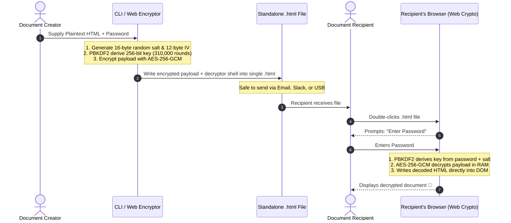

# 🔐 Self-Decrypting HTML Vault

> **Zero-Knowledge, Client-Side Encrypted Standalone HTML Documents using AES-256-GCM and PBKDF2 Web Crypto API.**

[](https://nodejs.org/)
[](https://en.wikipedia.org/wiki/Galois/Counter_Mode)
[](https://en.wikipedia.org/wiki/PBKDF2)
[](LICENSE)
[](https://Doctor9Trio.github.io/self-decrypting-html/)

---

### 🌐 Live Web Demo & Interactive Sandbox

Test both encryption and live decryption directly in your browser without installing anything:
* 🔒 **[Live Encryptor & Sandbox Portal](https://Doctor9Trio.github.io/self-decrypting-html/)** — Multi-tab portal with drag-and-drop encryption, live decryption sandbox, and interactive architecture flows.
* 🔓 **[Standalone Decryption Demo (`demo.html`)](https://Doctor9Trio.github.io/self-decrypting-html/demo.html)** — Experience the standalone unlock screen. *(Password: `ConfidentialPass2026!`)*

---

## 📖 Overview

**Self-Decrypting HTML Vault** allows you to package any HTML page, dashboard, or confidential report into a single standalone `.html` file that is **completely encrypted at rest**.

When the recipient double-clicks the file, it opens directly in Chrome, Safari, Firefox, or Edge. They enter the password, and their browser's native **Web Cryptography API** decrypts and renders the content directly in RAM.

* 🚫 **No Server Required:** Decryption runs 100% locally on the user's machine.
* 🚫 **No Software Needed:** Recipients don't need 7-Zip, GPG, or Python installed — just a modern web browser.
* 🚫 **Zero-Knowledge:** The password, password hash, and plaintext are **never stored** in the file.
* 🛡️ **Military-Grade Cryptography:** Powered by **AES-256-GCM** with **PBKDF2 (310,000 rounds of SHA-256)**.

---

### 📚 Learning & Education

Looking to deeply understand client-side cryptography? Check out our complete educational handbook:
👉 **[Read the Complete Masterclass Guide](docs/comprehensive-learning-guide.md)** — Covers mathematical concepts, line-by-line code breakdowns, top 7 vulnerabilities to avoid, and interview questions.

---

## 🔄 How It Works



---

## 🚀 Quick Start

### 1. Run the Demo

Clone the repo and run the automated demonstration:

```bash
git clone https://github.com/Doctor9Trio/self-decrypting-html.git
cd self-decrypting-html
npm run demo
```

This generates `examples/sample-report.enc.html`. Open it in any browser and use the password:
```text
ConfidentialPass2026!
```

---

### 2. Encrypt Your Own HTML Files (CLI)

Use the built-in CLI tool (no external dependencies required):

```bash
node bin/encrypt.mjs <inputFile.html> <password> [options]
```

#### CLI Options:
| Flag | Description | Default |
| :--- | :--- | :--- |
| `<inputFile.html>` | Path to the source HTML file to encrypt | *(Required)* |
| `<password>` | Password required to unlock the document | *(Required)* |
| `--title <title>` | Title displayed on the browser unlock card | `"Protected Document"` |
| `--user <username>` | Optional username to bind with password | *(None)* |
| `--out <outputFile>`| Destination output path | `<inputFile>.enc.html` |
| `--iterations <n>`  | PBKDF2 key stretching rounds | `310000` |

#### Examples:
```bash
# Basic encryption:
node bin/encrypt.mjs my-report.html "MySuperPassphrase#2026"

# Custom title and output path:
node bin/encrypt.mjs financial-audit.html "AuditVault@99!" \
  --title "Q3 Confidential Audit" \
  --out "Q3-Audit-Secured.html"
```

---

### 3. Use the In-Browser Studio (Web GUI)

Prefer a graphical interface? 

Simply open [`web/index.html`](file:///C:/Users/1000859/.gemini/antigravity-ide/scratch/self-decrypting-html/web/index.html) in your browser:

1. Drag and drop your `.html` file (or paste your HTML code).
2. Enter your password and title.
3. Click **Encrypt & Download**.
4. The encrypted, self-decrypting `.enc.html` file downloads instantly!

---

## 🔬 Cryptographic Deep Dive

| Component | Standard | Why It Was Chosen |
| :--- | :--- | :--- |
| **Cipher** | **AES-256-GCM** | Authenticated symmetric cipher. Guarantees confidentiality and tampering protection. Any incorrect password or corrupted byte immediately halts decryption with an `OperationError`. |
| **Key Derivation** | **PBKDF2-HMAC-SHA256** | Stretches user passwords into a cryptographic key. |
| **Work Factor** | **310,000 Rounds** | Conforms to official OWASP password storage/derivation baselines. Prevents rapid automated password guessing. |
| **Salt** | **16 Bytes CSPRNG** | Cryptographically secure random salt generated per document, neutralizing rainbow table attacks. |
| **IV / Nonce** | **12 Bytes CSPRNG** | 96-bit initialization vector ensures unique ciphertext outputs for every run. |
| **Runtime** | **`window.crypto.subtle`** | Native W3C Web Cryptography API implemented in C++ in Chrome, Safari, Firefox, and Edge. |

---

## 🛡️ Security & Threat Model

### What This Protects Against
* ✅ **Inspection / "View Page Source":** Plaintext does not exist in the file. Only base64 ciphertext is stored.
* ✅ **Tampering & Byte-Flipping:** AES-GCM's 128-bit authentication tag immediately detects any alterations.
* ✅ **Network Interception:** Zero data is transmitted over the internet; the entire operation runs in local browser RAM.
* ✅ **DevTools Bypassing:** Removing the login form in DevTools achieves nothing because the real HTML is mathematically encrypted.

### Crucial Security Considerations
* ⚠️ **Enforce Strong Passwords:** Because anyone who holds the `.html` file has the encrypted ciphertext, an attacker can attempt an **offline brute-force attack** using GPU clusters. Always use passphrases of **14+ characters**.
* ⚠️ **Not for SaaS Web Apps:** This is an offline container format. Real multi-tenant SaaS applications must always use server-side authentication with session tokens (JWT/Cookies) and database hashing (bcrypt/Argon2).

For an exhaustive cryptographic audit, read the [Threat Model Documentation](docs/threat-model.md).

---

## 📂 Repository Structure

```text
self-decrypting-html/
├── README.md               # Main documentation & architecture guide
├── package.json            # Node.js project manifest & scripts
├── .gitignore              # Ignores build artifacts and encrypted outputs
├── bin/
│   └── encrypt.mjs         # Standalone zero-dependency CLI tool
├── web/
│   └── index.html          # Browser-based GUI encryption studio
├── examples/
│   ├── sample-report.html  # Generic confidential business report example
│   └── generate-demo.mjs   # One-command demo builder
└── docs/
    └── threat-model.md     # In-depth security analysis & OWASP alignment
```

---

## 📜 License

MIT License. Free for personal, academic, and commercial use.
