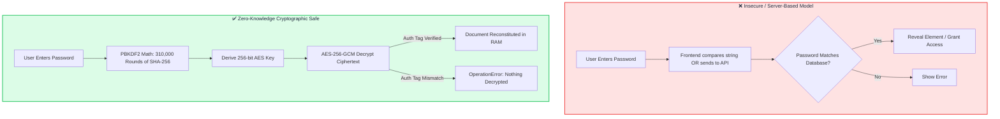
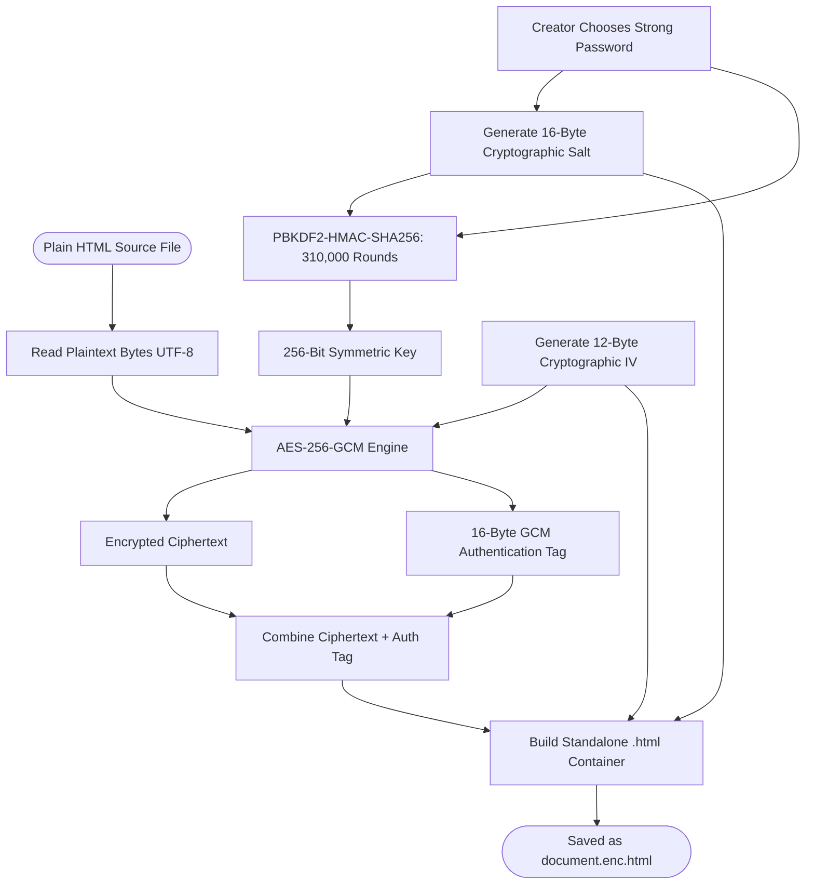
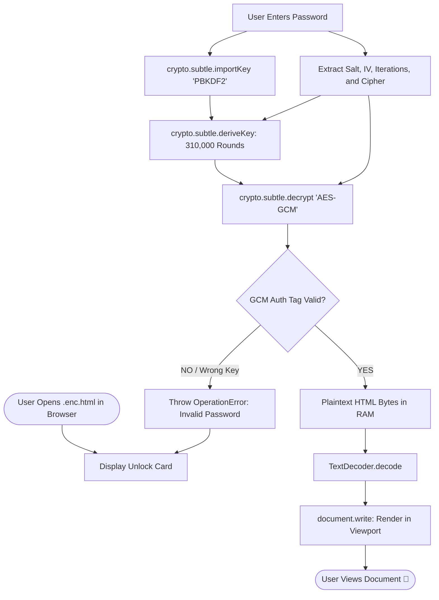
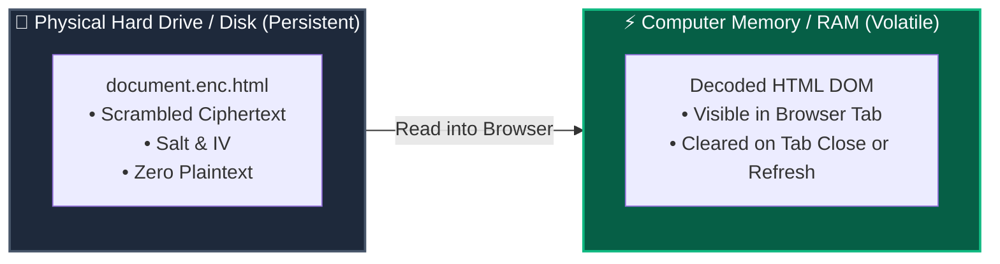

# 🎓 The Complete Masterclass: Client-Side HTML Encryption

This guide is designed as an all-in-one educational handbook. By reading through this document, you will understand the fundamentals, mathematical concepts, code mechanics, visual architectural flows, and security trade-offs of self-decrypting, zero-knowledge web pages.

---

## Table of Contents
1. [Core Concept & Mental Model](#1-core-concept--mental-model)
2. [Why Traditional Web Knowledge Doesn't Apply Here](#2-why-traditional-web-knowledge-doesnt-apply-here)
3. [The Three Cryptographic Pillars](#3-the-three-cryptographic-pillars)
   - [Pillar 1: Key Derivation (PBKDF2)](#pillar-1-key-derivation-pbkdf2)
   - [Pillar 2: Authenticated Encryption (AES-256-GCM)](#pillar-2-authenticated-encryption-aes-256-gcm)
   - [Pillar 3: Native Web Cryptography API](#pillar-3-native-web-cryptography-api)
4. [Visual Architecture & Flow Diagrams](#4-visual-architecture--flow-diagrams)
   - [Encryption Flowchart (Document Creator)](#encryption-flowchart-document-creator)
   - [Decryption Flowchart (Browser Recipient)](#decryption-flowchart-browser-recipient)
   - [Memory & Volatility Lifecycle (Disk vs. RAM)](#memory--volatility-lifecycle-disk-vs-ram)
5. [Side-by-Side: The Wrong Way vs. The Secure Way](#5-side-by-side-the-wrong-way-vs-the-secure-way)
6. [Line-by-Line Code Breakdown](#6-line-by-line-code-breakdown)
   - [Part A: The Encryption Engine (Node.js)](#part-a-the-encryption-engine-nodejs)
   - [Part B: The Decryption Engine (Browser)](#part-b-the-decryption-engine-browser)
7. [The Payload Data Structure](#7-the-payload-data-structure)
8. [Top 7 Pitfalls & Vulnerabilities to Avoid](#8-top-7-pitfalls--vulnerabilities-to-avoid)
9. [Comprehensive FAQ & Interview Questions](#9-comprehensive-faq--interview-questions)

---

## 1. Core Concept & Mental Model

### The "Combination Safe" Analogy
In a standard website login:
* The website has a guestbook on a server.
* You show your ID and password.
* The server checks its database: *"Yes, your password matches. Come in."*

In a **Self-Decrypting HTML file**:
* There is **no server** and **no database**.
* The file is like a **physical steel combination safe** delivered to your doorstep.
* Inside the safe is the secret document.
* There is **no electronic chip** checking if your combination is right or wrong.
* **If you turn the dial to the exact combination, the mechanical tumblers physically align and the door opens.**
* If you turn to the wrong number, the tumblers simply do not move.



---

## 2. Why Traditional Web Knowledge Doesn't Apply Here

Web developers are taught:
> *"Never trust the client. Any check done in client-side JavaScript can be bypassed in Chrome DevTools."*

While that is true for ordinary frontend validation (like hiding an element with `display: none` or `if (password === 'secret')`), **it does NOT apply to cryptography**:

1. **You cannot "bypass" mathematical encryption.**
   If you open DevTools, delete the login form, and inspect the code, there is no document hidden in the HTML. The document is literally an array of millions of random scrambled numbers.
2. **Without the key, the plaintext does not exist anywhere in the universe.**
   The HTML is only reconstituted dynamically in volatile RAM after successful mathematical decryption.

---

## 3. The Three Cryptographic Pillars

### Pillar 1: Key Derivation (PBKDF2)
* **The Problem:** AES-256 requires a completely random 256-bit key (32 bytes). Human passwords (like `Dragon#2026`) are words with low entropy, not 32 random bytes.
* **The Solution:** **PBKDF2** (Password-Based Key Derivation Function 2).
* **Salt:** A 16-byte random sequence generated uniquely for each file. It ensures two files with the same password have completely different encryption keys.
* **Work Factor (310,000 rounds):** PBKDF2 hashes the password with HMAC-SHA-256 repeatedly 310,000 times.
  * For you: Running 310,000 rounds takes **0.05 seconds** once. You won't even notice the delay.
  * For a hacker: An attacker trying to guess 1,000,000,000 passwords must compute 310,000 rounds * 1,000,000,000 times, requiring immense computing power and decades of time.

### Pillar 2: Authenticated Encryption (AES-256-GCM)
* **AES (Advanced Encryption Standard):** The gold-standard symmetric block cipher approved by NIST and global security agencies.
* **GCM (Galois/Counter Mode):** Provides **AEAD** (Authenticated Encryption with Associated Data).
* **The Authentication Tag (16 bytes):** 
  * In older ciphers (like AES-CBC), an attacker could flip bits in the ciphertext to alter the output.
  * In GCM, a cryptographic signature (Auth Tag) is calculated over the entire ciphertext.
  * If a single byte of ciphertext or key is wrong, decryption immediately aborts with an `OperationError`. **No corrupted or partial data is ever leaked.**

### Pillar 3: Native Web Cryptography API
* Before 2017, web encryption required external JavaScript libraries (like CryptoJS), which were slow and susceptible to side-channel timing attacks.
* Today, all modern browsers include **`window.crypto.subtle`**:
  * Implemented natively in C++ inside the browser engine.
  * Constant-time execution (immune to JavaScript timing attacks).
  * Direct access to hardware-accelerated CPU instructions (AES-NI).

---

## 4. Visual Architecture & Flow Diagrams

### Encryption Flowchart (Document Creator)



---

### Decryption Flowchart (Browser Recipient)



---

### Memory & Volatility Lifecycle (Disk vs. RAM)



---

## 5. Side-by-Side: The Wrong Way vs. The Secure Way

### ❌ The Insecure Way (How Beginners Get Hacked)
```javascript
// BAD CODE: DO NOT USE
const secretPassword = "MyCompanySecret2026"; // ⚠️ Plaintext in source!

document.getElementById("btn").addEventListener("click", () => {
  const entered = document.getElementById("pass").value;
  if (entered === secretPassword) {
    // ⚠️ Hidden element was already loaded in DOM; easily bypassed in F12 DevTools!
    document.getElementById("secret-report").style.display = "block";
  }
});
```

### ✅ The Secure Way (Zero-Knowledge Cryptography)
```javascript
// SECURE CODE: The password is NEVER stored.
// The document content is encrypted ciphertext.
const material = await crypto.subtle.importKey(
  "raw", new TextEncoder().encode(password), "PBKDF2", false, ["deriveKey"]
);

const aesKey = await crypto.subtle.deriveKey(
  { name: "PBKDF2", salt: toBytes(PAYLOAD.salt), iterations: 310000, hash: "SHA-256" },
  material, { name: "AES-GCM", length: 256 }, false, ["decrypt"]
);

// Decryption will THROW an error if password is even 1 character off!
const plainBuffer = await crypto.subtle.decrypt(
  { name: "AES-GCM", iv: toBytes(PAYLOAD.iv) },
  aesKey,
  toBytes(PAYLOAD.cipher)
);

// Only reconstituted if math passes
document.open();
document.write(new TextDecoder().decode(plainBuffer));
document.close();
```

---

## 6. Line-by-Line Code Breakdown

### Part A: The Encryption Engine (Node.js)

From [`bin/encrypt.mjs`](../bin/encrypt.mjs):

```javascript
// 1. Generate 16-byte random salt and 12-byte IV using CSPRNG
const salt = crypto.randomBytes(16);
const iv = crypto.randomBytes(12);
const iterations = 310000;

// 2. Derive 256-bit key from password using PBKDF2 with SHA-256
const keyMaterial = Buffer.from(password, 'utf-8');
const derivedKey = crypto.pbkdf2Sync(keyMaterial, salt, iterations, 32, 'sha256');

// 3. Encrypt plaintext HTML using AES-256-GCM
const cipher = crypto.createCipheriv('aes-256-gcm', derivedKey, iv);
const encryptedBytes = Buffer.concat([
  cipher.update(Buffer.from(plainHtml, 'utf-8')),
  cipher.final()
]);

// 4. Extract the 16-byte GCM Authentication Tag
const authTag = cipher.getAuthTag();

// 5. Append authentication tag to ciphertext (Standard for Web Cryptography API)
const combinedCipher = Buffer.concat([encryptedBytes, authTag]);
```

---

### Part B: The Decryption Engine (Browser)

From the generated `.enc.html` unlock script:

#### Step 1: Converting the user password to key material
```javascript
const pass = document.getElementById("p").value;
const rawKey = await crypto.subtle.importKey(
  "raw",                                // Format: raw bytes
  new TextEncoder().encode(pass),       // Convert UTF-8 string to Uint8Array
  "PBKDF2",                             // Target algorithm
  false,                                // Key is not extractable
  ["deriveKey"]                         // Permitted usage: derive another key
);
```

#### Step 2: Deriving the AES-256-GCM key with PBKDF2
```javascript
const aesKey = await crypto.subtle.deriveKey(
  {
    name: "PBKDF2",
    salt: toBytes(PAYLOAD.salt),        // 16-byte random salt
    iterations: PAYLOAD.iterations,     // 310,000 rounds
    hash: "SHA-256"                     // Underlying hash function
  },
  rawKey,                               // The password material from Step 1
  { name: "AES-GCM", length: 256 },     // Target: AES 256-bit key
  false,                                // Key cannot be exported
  ["decrypt"]                           // Permitted usage: decrypt only
);
```

#### Step 3: Decrypting the payload
```javascript
const decryptedBuffer = await crypto.subtle.decrypt(
  {
    name: "AES-GCM",
    iv: toBytes(PAYLOAD.iv)             // 12-byte initialization vector
  },
  aesKey,                               // The derived AES key
  toBytes(PAYLOAD.cipher)               // Ciphertext + 16-byte Auth Tag
);
```

#### Step 4: Rendering into the DOM
```javascript
const html = new TextDecoder().decode(decryptedBuffer);
document.open();
document.write(html);
document.close();
```
* `document.open()` clears the unlock login screen.
* `document.write(html)` injects the decrypted HTML directly into memory.
* As soon as the tab closes, the decrypted memory is discarded.

---

## 7. The Payload Data Structure

Inside the generated `.enc.html` file, you will find this JSON object:

```javascript
const PAYLOAD = {
  "salt": "u8K9z...==",       // 16 bytes base64 (Prevents rainbow tables)
  "iv": "3d9J...==",          // 12 bytes base64 (Guarantees unique ciphertext)
  "iterations": 310000,       // Work factor for PBKDF2
  "cipher": "m7tr...=="       // AES-GCM ciphertext + 16-byte authentication tag
};
```

Notice what is **NOT** present:
* ❌ No password
* ❌ No password hash (no MD5, no SHA-256)
* ❌ No hint or verification string

---

## 8. Top 7 Pitfalls & Vulnerabilities to Avoid

When building client-side encrypted pages, avoid these critical mistakes:

1. **Reusing the IV (Initialization Vector):**
   * *Mistake:* Hardcoding a fixed IV for multiple encryptions.
   * *Consequence:* Two-time pad vulnerability in AES-GCM leaks plaintext relationships.
   * *Rule:* Always generate `crypto.randomBytes(12)` fresh for every file.

2. **Using too few PBKDF2 iterations:**
   * *Mistake:* Using 1,000 or 10,000 iterations.
   * *Consequence:* Fast GPU password cracking tools (Hashcat) can guess millions of passwords per second.
   * *Rule:* Use at least 310,000 rounds.

3. **Using AES-CBC instead of AES-GCM:**
   * *Mistake:* Using CBC mode without an HMAC signature.
   * *Consequence:* Vulnerable to padding oracle attacks and bit tampering.
   * *Rule:* Always use AES-GCM (Authenticated Encryption).

4. **Weak Passwords:**
   * *Mistake:* Using `secret` or `password123`.
   * *Consequence:* Anyone with the file can run an offline dictionary attack.
   * *Rule:* Use passphrases with 14+ characters.

5. **Storing the decrypted text in `localStorage`:**
   * *Mistake:* Saving `localStorage.setItem('doc', html)` for "convenience".
   * *Consequence:* Leaves an unencrypted copy permanently on the user's hard drive.
   * *Rule:* Keep decrypted content exclusively in volatile RAM.

6. **Using this for SaaS Multi-Tenant Logins:**
   * *Mistake:* Replacing a database-backed backend login with client-side HTML encryption.
   * *Rule:* Web apps with user accounts require server-side authentication (bcrypt/Argon2 + secure session cookies).

7. **Forgetting password recovery is impossible:**
   * *Rule:* There is no "Forgot Password" button. If the password is lost, the file cannot be decrypted by anyone.

---

## 9. Comprehensive FAQ & Interview Questions

### Q1: Can a hacker open Chrome DevTools and bypass the login?
**No.** In standard web apps, a hacker can bypass frontend gates because the secret data is already present in the DOM or fetched via unauthenticated APIs. In this architecture, the data is physically encrypted with AES-256. Bypassing the JS leaves the attacker with raw random bytes.

### Q2: What happens if I forget my password?
The data is permanently lost. There is no backdoor, master key, or recovery mechanism.

### Q3: Does this work completely offline?
**Yes.** Once the `.html` file is downloaded, you can turn off Wi-Fi, unplug Ethernet, and open the file. The browser's native Web Crypto API runs 100% on your local CPU.

### Q4: Why combine username and password in some implementations?
Adding `user + "\0" + pass` into PBKDF2 key material binds the key to both the identity and password. An attacker must know both fields to compute the matching AES key.

### Q5: How fast is decryption on a mobile phone?
The Web Crypto API is implemented in compiled C++ inside mobile Safari (iOS) and Chrome (Android). Computing 310,000 iterations takes approximately **60 to 120 milliseconds** on modern smartphones.

---

## 🏁 Summary Checklist for Production

- [x] Salt generated using CSPRNG (16 bytes).
- [x] Unique IV generated for every document (12 bytes).
- [x] PBKDF2 configured with SHA-256 and $\ge 310,000$ iterations.
- [x] Cipher set to AES-256-GCM with authentication tag appended.
- [x] In-memory DOM injection without saving to disk or `localStorage`.
- [x] Passphrase complexity enforced ($\ge 14$ characters recommended).
